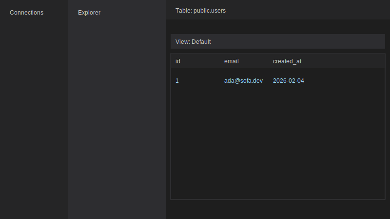
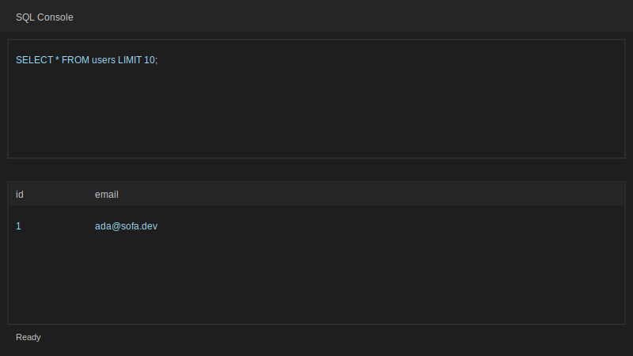

# Sofa Studio 🛋️

A modern, open-source database client built with Qt 6 (QML + C++).

## Goal

To provide a minimalist, fast, and extensible SQL client, inspired by the "VS Code" philosophy but for databases.

## MVP Features

- [x] Postgres support via add-on
- [x] SQL console with async run and cancel
- [x] Universal DataGrid engine (QML + C++)
- [x] Beauty Mode (views for tables)
- [x] Local persistence for connections, views, and query history
- [x] Loading and empty states for datasets

## Connect to Postgres

1. Click New Connection.
2. Fill Host, Port, Database, User, Password.
3. Use Test Connection to validate.
4. Save and click the connection in the sidebar.
5. Open tables from the Explorer or start a SQL Console tab.

## Screenshots

## Getting Started

See [Getting Started Guide](docs/01-getting-started.md).

## License

TBD
